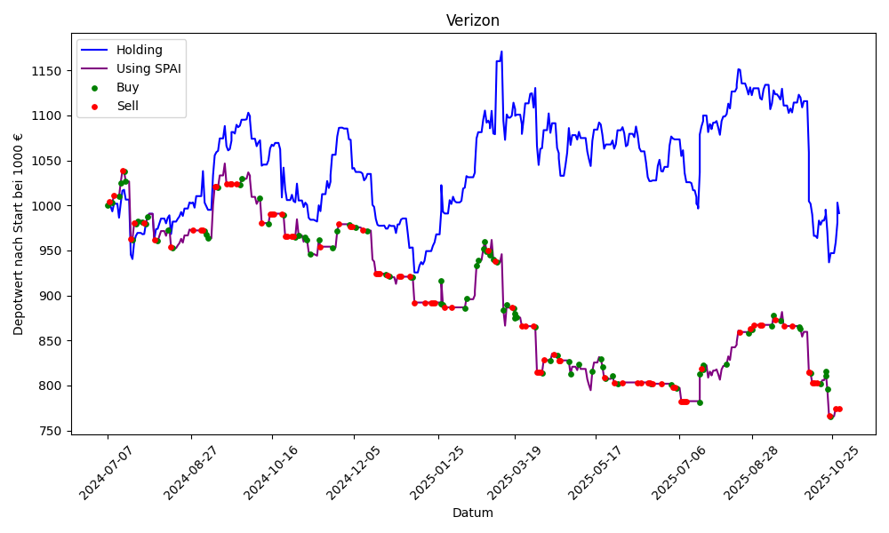

# Stock Prediction AI

Stock Prediction AI is a proof-of-concept program designed to demonstrate that the stock market is not entirely unpredictable. The project consists of two main Python scripts: `collector.py` and `predict_and_trade.py`.

- **`collector.py`**: This script gathers daily financial data for a list of tracked stocks. It collects general stock information, news articles related to the company and its CEO, and performs sentiment analysis on the news using the FinBERT model.

- **`predict_and_trade.py`**: This script uses the collected data to train a linear regression model. It then predicts the next day's stock price movement and simulates a trading decision (Buy, Sell, or Hold) based on the prediction. The results of the simulation, including the depot value over time, are saved and visualized.

The process is automated to run daily via a GitHub Actions workflow, which you can find in `.github/workflows/daily_collector.yml`.

Please note, that the Program is not able to trade on weekends. So the flag is always set to hold.

## Setup

To get started with this project, follow these steps:

1.  **Clone the repository:**
    ```bash
    git clone https://github.com/CastIehard/Stock-Prediction-AI.git
    cd Stock-Prediction-AI
    ```

2.  **Install dependencies:**
    Make sure you have Python 3 installed. Then, install the required packages using pip:
    ```bash
    pip install -r requirements.txt
    ```

3.  **Set up API Keys:**
    This project requires API keys from [Alpha Vantage](https://www.alphavantage.co) (for stock data) and [NewsAPI](https://newsapi.org) (for news articles). You need to set them as environment variables named `ALPHA_API_KEY` and `NEWS_API_KEY`.

    If you plan to use the automated GitHub workflow, you should add these keys as secrets to your GitHub repository with the names `ALPHA_API_KEY` and `NEWS_API_KEY`. You will also need to create a personal access token with repository write permissions and add it as a secret named `ACCESS_TOKEN`.

## How to Adjust the Program

You can customize the program in the following ways:

-   **Track different stocks:** To add or remove stocks from the analysis, simply edit the `tracked_stocks.csv` file. Add the company name, stock ticker, and CEO's name for each stock you want to track.

-   **Adjust the trading strategy:** The trading logic is controlled by constants at the beginning of `predict_and_trade.py`:
    -   `TRAINING_AMOUNT`: The number of recent data points to use for training the model.
    -   `BUY_THRESHOLD` / `SELL_THRESHOLD`: The prediction value thresholds that trigger a "Buy" or "Sell" action.
    -   `TRADE_COST`: The cost of a single trade.

-   **Modify the automation:** The schedule for the daily data collection and trading simulation is defined by a cron job in `.github/workflows/daily_collector.yml`. You can change the schedule to fit your needs.

## Current Status of Adobe Stock Prediction

## Current Status of Verizon Stock Prediction



## Contributing

Contributions to Stock Prediction AI are welcome. Please feel free to fork the repository, make improvements, and submit pull requests.

## License

This project is licensed under the MIT License - see the [LICENSE](LICENSE) file for details.

## Authors
- **Luca Burghard**
For any questions, suggestions, or contributions, please contact me at luca@castlehard.com