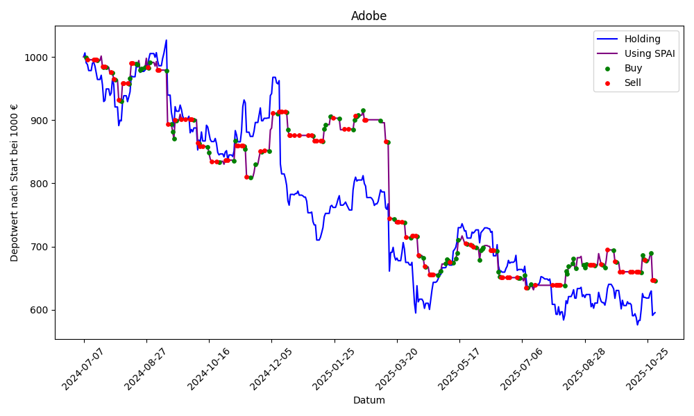

# Stock Prediction AI

Stock Prediction AI is a proof-of-concept program designed to demonstrate that the stock market is not entirely unpredictable.

Please note, that the Program is not able to trade on weekends. So the flag is always set to hold. 
## Current Status of Adobe Stock Prediction

## Current Status of Verizon Stock Prediction

## Contributing

Contributions to Stock Prediction AI are welcome. Please feel free to fork the repository, make improvements, and submit pull requests.

## License

This project is licensed under the MIT License - see the [LICENSE](LICENSE) file for details.

## Authors
- **Luca Burghard**
For any questions, suggestions, or contributions, please contact me at luca@castlehard.com

## Support
For support, please open an issue on the GitHub repository page.
